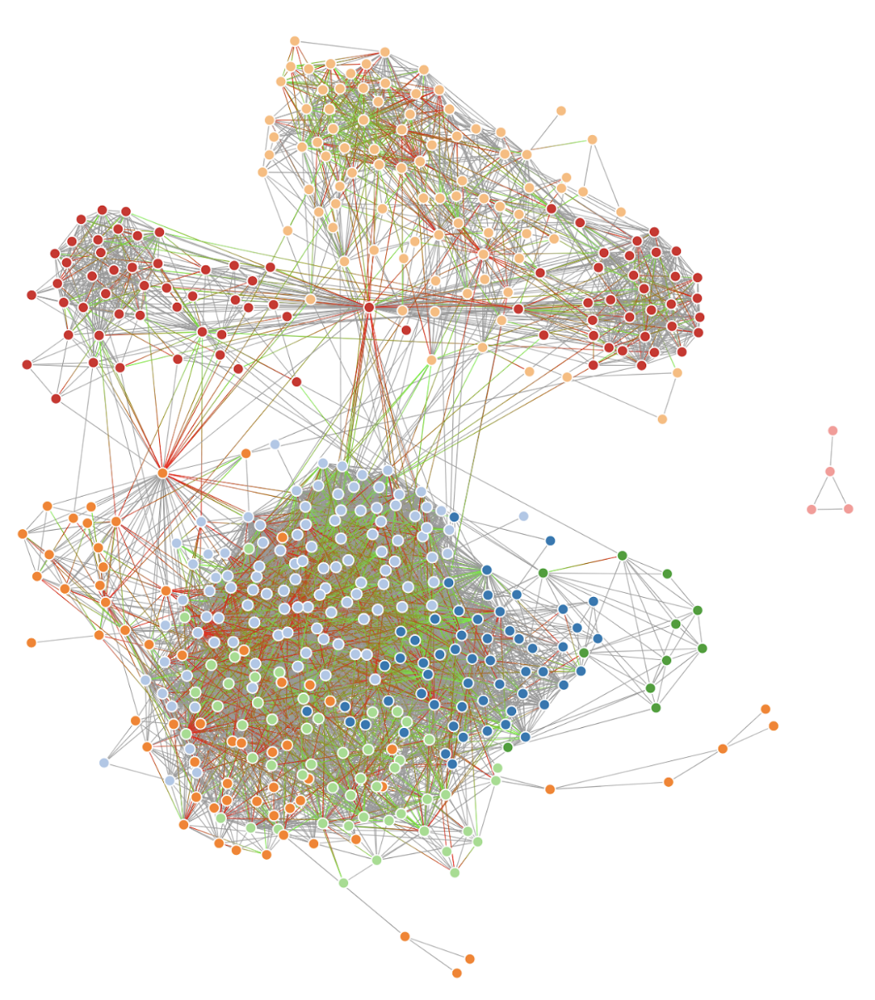

# Predicting Engagement: Social Network Analysis and Deep Learning Techniques

## Introduction

Social networks play an increasing role in our daily lives. They have become a priority for brand marketing, with Instagram being a platform with one of the highest engagement rates. The data from these networks can be useful for other things, too. As an example, [this study](https://www.jmir.org/2019/6/e12554/) used data from Reddit to examine the effectiveness of different methods that can provide an early detection of major depressive disorders (MDDs). The objective of this project is to visualize my social network, applying graph theory to better understand it and to create a multi-input model that will predict the engagement of a post.

    

A full presentation of this project can be found [here.](https://github.com/rmesrobi/predicting_engagement/blob/main/presentation/predicting_engagement_presentation.pdf)

This [gist](https://bl.ocks.org/pkerpedjiev/f2e6ebb2532dae603de13f0606563f5b) and [medium](https://medium.com/@maximpiessen/how-i-visualised-my-instagram-network-and-what-i-learned-from-it-d7cc125ef297) post are wonderful references if anyone is interested in visualizing their Instagram network and applying graph theory to better understand it. I would not have been able to do so without their walkthroughs! 

## Summary

At first I tried to classify post images and text by community and then by engagement level (ranking 0 - 3). This proved to be very difficult and somewhat unsuccessful. When classifying images, I achieved an accuracy score just above random guessing. When classifying text, I achieved slightly better results using a Multinomial Naive Bayes classifier.

I decided to then try to predict the engagement value of a post using a myriad of regression models. I first used transfer learning to predict engagement on images. I did this by deploying the Xception and VGG-19 neural networks. I then used Google's NIMA model to extract features from the images, such as: image aesthetic and technical quality. I incorporated these features with the rest of my tabular data and was able to achieve a mean squared error of 1.89 using a gradient boosted random forest regressor. It's important to note that engagement scores were normalized, meaning they represented an array of values within my network. When predicting unnormalized engagement (likes + comments) / followers I was able to achieve a mean squared error of less than 0.1. 
